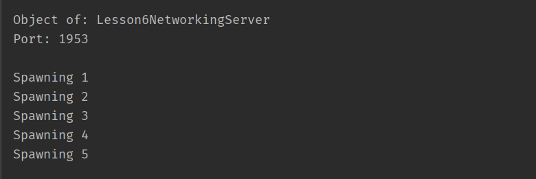

#Java Networking

The Lesson6NetworkingServer and the Lesson6NetworkingClient programs operate in concert to demonstrate the networking support built into the Java programming language. As their names imply, the Lesson6NetworkingServer provides the services, and the Lesson6NetworkingClient accesses those services.

The Lesson6NetworkingServer program is invoked as follows:
```
java Lesson6NetworkingServer --port <number>
```
The “—port ” option is required, and must include a numeric argument specifying the “port” on which Lesson6NetworkingServer will listen for requests.

The only other option to the Lesson6NetworkingServer program is “—help”. When Lesson6NetworkingServer is invoked with the “—help” option, it displays the following syntax diagram:
```
Usage: Lesson6NetworkingServer [--help]          # Displays this command syntax summary
       Lesson6NetworkingServer {--port <number>} # Listen for connections on port <number>
```
the “—help” option supersedes all other options. When the “— help” option appears on the command line, all other options are ignored. Only the syntax diagram is displayed.

The Lesson6NetworkingClient program is invoked as follows:
```
java Lesson6NetworkingClient –-server <address> --port <number>
```
Both the “—server” and the “—port” options are required. The “—server” option must include a string argument containing the address (i.e., URL or IP address) of the device on which the service is located.

The “—port” option must include a number representing the “port” to which the client will try to connect.

The only other option to the Lesson6NetworkingClient program is “—help”. When Lesson6NetworkingServer is invoked with the “—help” option, it displays the following syntax diagram:
```
Usage: Lesson6NetworkingClient [--help]                                # Displays this command syntax summary
       Lesson6NetworkingClient {--server <address>} {--port <number>}  # Connect to the server at <address> on port <number>
```
The “—help” option supersedes all other options. When the “— help” option appears on the command line, all other options are ignored. Only the syntax diagram is displayed.

The Lesson6NetworkingServer program utilizes Java Threads to manage multiple connections. When it starts, Lesson6NetworkingServer displays the following:


Every time the client makes a successful connection to the server…



…Lesson6NetworkingServer adds another "Spawning…" message to the console…

If Lesson6NetworkingClient manages to make a successful connection, it displays the following:


Using a browser to connect to the server yields the following:


